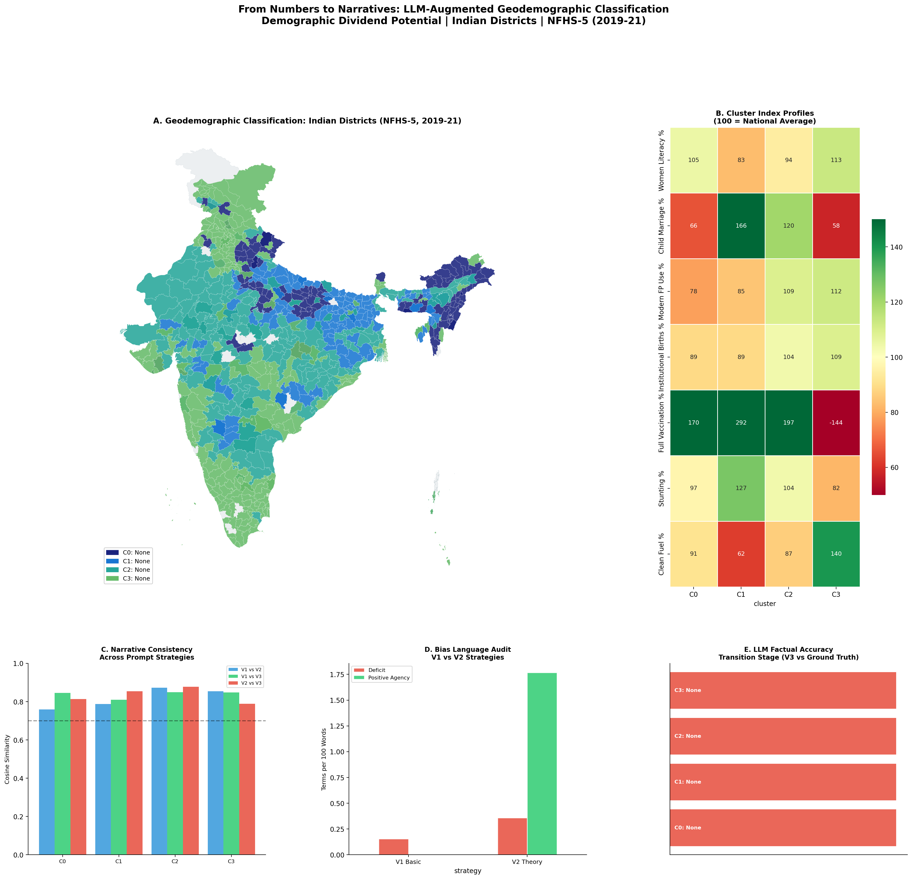
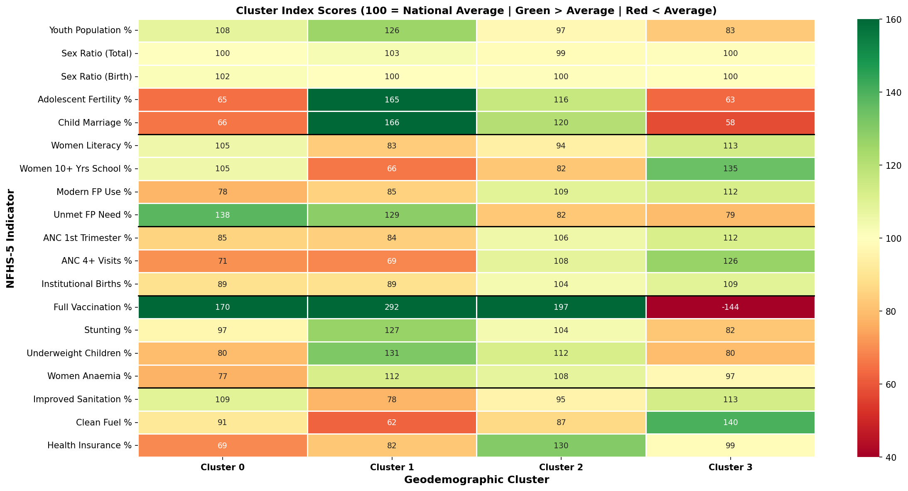
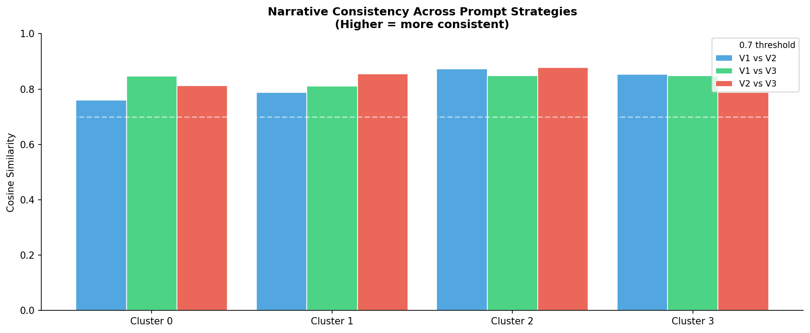
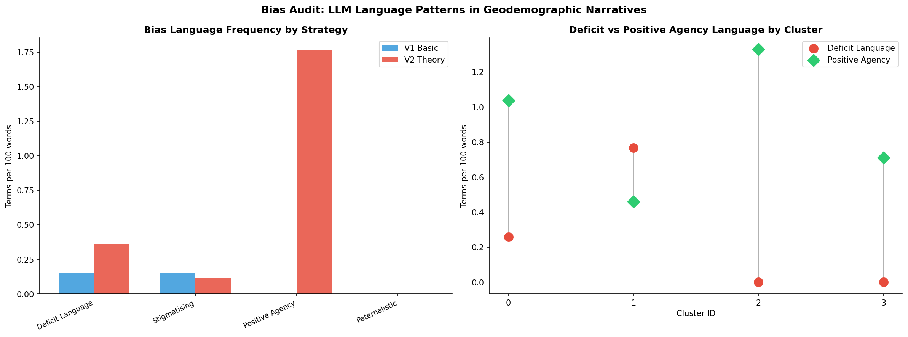

# From Numbers to Narratives
### LLM-Augmented Geodemographic Classification of Demographic Dividend Potential in Indian Districts



> **Can Large Language Models translate complex demographic cluster profiles into accurate, policy-ready narratives — and can we systematically measure the quality and bias of what they produce?**

---

## Table of Contents

- [Rationale](#rationale)
- [Aims and Objectives](#aims-and-objectives)
- [Datasets](#datasets)
- [Methodology at a Glance](#methodology-at-a-glance)
- [Geodemographic Classification Results](#geodemographic-classification-results)
- [LLM Narrative Generation](#llm-narrative-generation)
- [Evaluation Results](#evaluation-results)
- [Key Findings](#key-findings)
- [Project Structure](#project-structure)
- [How to Reproduce](#how-to-reproduce)
- [Dependencies](#dependencies)
- [References](#references)

---

## Rationale

### The Global Challenge: Data-Rich, Insight-Poor

The twenty-first century has seen an unprecedented accumulation of demographic and health data, yet the core challenge remains: translating data into understanding, and understanding into action. The gap is not technical - the tools and data exist. It is communicative. The people who need to act on demographic intelligence rarely speak the language of PCA biplots or index score heatmaps. District magistrates, block-level health officers, and state legislators need narratives, not matrices.
This problem is sharpest in low- and middle-income nations, precisely where demographic change is most consequential, and where the interpretive infrastructure that higher-income countries take for granted, policy briefs, typologies, evidence syntheses, is thinnest.
The Demographic Dividend: A Closing Window

As countries transition from high to low fertility, a window of 2-3 decades opens where the working-age population is large relative to dependents
If this cohort is educated, healthy, and employable, the dividend materialises as accelerated economic growth; if not, the window closes unrealised
South and Southeast Asia are mid-transition; Sub-Saharan Africa is entering it
The policy decisions of the next 10-15 years on girls' education, reproductive health, and child nutrition will determine whether the dividend is captured or squandered
Demographic transition is not national, it plays out at district and block level, and national-level data actively masks this heterogeneity

India as a Critical Case

1.4 billion people, 36 states and Union Territories, 740 districts, simultaneously at early, mid, and late transition stages
Bihar and Meghalaya resemble sub-Saharan Africa circa the 1990s; Tamil Nadu and Kerala are already managing an ageing population
Despite this, no reproducible, openly published geodemographic typology of Indian districts exists framed around demographic dividend potential
The UK has the Output Area Classification (OAC); the US has PRIZM and Mosaic; India has no district-level equivalent

The LLM Opportunity - and the Risk

LLMs offer, for the first time, a mechanism to automatically convert statistical cluster profiles into plain-language narratives that policymakers can read and act on
But LLMs trained on Global North corpora carry embedded assumptions about "development" and "progress", risking narratives that reinforce deficit framings, stigmatise historically disadvantaged regions, or present structural inequality as cultural pathology
This risk is largely unevaluated, especially for place-based characterisation in Global South contexts

What This Project Does
Builds the first openly reproducible geodemographic classification of Indian districts framed around demographic dividend potential using NFHS-5 (2019-21), then uses it as a test bed to systematically evaluate LLMs as narrative interpreters of demographic data - comparing three prompt engineering strategies across accuracy, semantic consistency, and language bias.
---

## Aims and Objectives

**Primary Aim:**  
To develop, evaluate, and openly publish a reproducible geodemographic classification of Indian districts based on NFHS-5 indicators, augmented by LLM-generated narrative descriptions of each cluster type.

**Objectives:**

| # | Objective |
|---|-----------|
| 1 | Select and justify a theoretically grounded set of NFHS-5 variables capturing demographic transition across five domains: age structure, women's empowerment, maternal health, child health, and living standards |
| 2 | Apply a standard geodemographic pipeline (standardisation --> PCA --> k-means --> index scoring) to classify all 707 districts into geodemographic cluster types |
| 3 | Map the classification spatially to reveal geographic patterns of demographic dividend potential across India |
| 4 | Design and compare three prompt engineering strategies (Basic, Theory-Grounded, Structured + Bias-Aware) for LLM-generated narrative descriptions of each cluster |
| 5 | Evaluate LLM output quality through semantic consistency analysis, bias auditing, and factual accuracy checking |
| 6 | Produce an openly reproducible, fully documented codebase that can be extended to future NFHS rounds or adapted for other national survey datasets |

---

## Datasets

### 1. NFHS-5 District Factsheet Data (2019–21)

| Attribute | Detail |
|-----------|--------|
| **Full name** | National Family Health Survey — Round 5 |
| **Coverage** | 707 districts across 36 States and Union Territories of India |
| **Variables available** | 109 demographic, health, nutrition, and living standards indicators |
| **Variables used** | 19 (selected across 5 thematic domains) |
| **Reference period** | 2019–2021 |
| **Publisher** | International Institute for Population Sciences (IIPS) and ICF, Ministry of Health and Family Welfare, Government of India |
| **Missing values** | 0 — complete data for all 19 selected variables across all 707 districts |

> **📥 [Download from data.gov.in — NFHS-5 India Districts Factsheet Data (Provisional)](https://www.data.gov.in/catalog/national-family-health-survey-5-nfhs-5-india-districts-factsheet-data-provisional)**  
> *India's Open Government Data Platform — official, freely accessible, no login required*

> **📄 [Full NFHS-5 India Report (IIPS)](http://rchiips.org/nfhs/NFHS-5Reports/NFHS-5_INDIA_REPORT.pdf)**  
> *Complete methodology, questionnaires, and national/state-level findings*

> **🌐 [NFHS-5 District Factsheets Portal (IIPS)](http://rchiips.org/nfhs/districtfactsheet_NFHS-5.shtml)**  
> *State-wise downloadable PDFs and the compiled district factsheet Excel file*

NFHS is India's implementation of the global DHS (Demographic and Health Survey) programme. Round 5 (2019–21) is the most geographically granular national health survey conducted in India to date — the first round to cover all districts — making it the definitive source for sub-national demographic analysis.

**Variables selected across 5 thematic domains:**

```
Domain 1 — Age Structure & Fertility
  ├── Population below age 15 years (%)
  ├── Sex ratio of total population (females per 1,000 males)
  ├── Sex ratio at birth (females per 1,000 males)
  ├── Women age 15–19 already mothers or pregnant (%)
  └── Women age 20–24 married before age 18 (%)

Domain 2 — Women's Empowerment
  ├── Women age 15–49 who are literate (%)
  ├── Women age 15–49 with 10+ years of schooling (%)
  ├── Currently married women using any modern FP method (%)
  └── Total unmet need for family planning (%)

Domain 3 — Maternal Health Services
  ├── Mothers with ANC check-up in first trimester (%)
  ├── Mothers with 4+ antenatal care visits (%)
  └── Institutional births in last 5 years (%)

Domain 4 — Child Health & Nutrition
  ├── Children age 12–23 months fully vaccinated (%)
  ├── Children under 5 who are stunted (%)
  ├── Children under 5 who are underweight (%)
  └── All women age 15–49 who are anaemic (%)

Domain 5 — Living Standards & Access
  ├── Households using improved sanitation facility (%)
  ├── Households using clean fuel for cooking (%)
  └── Households with health insurance coverage (%)
```

### 2. India District Boundary Shapefile (Census 2011)

| Attribute | Detail |
|-----------|--------|
| **Source** | Census of India 2011, Survey of India |
| **Repository** | datameet/maps — open community GIS repository |
| **Projection** | WGS84 / EPSG:4326 |
| **Districts geocoded** | 694 of 707 NFHS-5 districts (via fuzzy name matching) |

> **🗺️ [Download from datameet/maps — Census 2011 District Boundaries](https://github.com/datameet/maps/tree/master/Districts/Census_2011)**  
> *Open-source, community-maintained shapefile for all Indian districts*

---

## Methodology at a Glance

```
NFHS-5 District Data  (707 districts × 109 variables)
              │
              ▼
     Variable Selection
     19 variables · 5 thematic domains
     Theoretically grounded · policy-actionable
              │
              ▼
     Z-Score Standardisation
     Zero mean · unit variance
              │
              ▼
     Principal Component Analysis
     Retain components explaining 80% variance
     PC1 = demographic transition axis
     PC2 = service access axis
              │
              ▼
     K-Means Clustering  (k = 3–9 tested)
     Optimal k by silhouette score + elbow method
     100 random initialisations for stability
              │
              ▼
     Index Score Profiling
     (Cluster Mean / National Mean) × 100
              │
              ▼
     Geospatial Mapping
     Static choropleth + interactive Folium map
              │
              ▼
     LLM Narrative Generation
     3 prompt strategies × 4 clusters
     Claude claude-sonnet-4-6 via Anthropic API
              │
              ▼
     Evaluation
     ├── Semantic consistency  (cosine similarity)
     ├── Bias audit            (lexical frequency)
     └── Factual accuracy      (V3 vs ground truth)
```

---

## Geodemographic Classification Results

The optimal solution was **k = 4 clusters**, selected by silhouette analysis, classifying **694 districts** across all 36 states and Union Territories.

### Cluster Index Score Heatmap



> Each cell shows the cluster mean as an index relative to the national average (100 = national mean). **Green = above average · Red = below average.** The stronger the divergence from 100, the more that indicator defines the cluster's character.

---

### Cluster 0 — *"Transitional Highlands with Unfinished Foundations"* · 117 districts
**States:** Uttar Pradesh · Arunachal Pradesh · Nagaland · Manipur  
**Stage:** Mid-transition | **Dividend Potential:** Moderate

Adolescent fertility (index 65) and child marriage (index 66) are well below the national average — unusual for a cluster spanning UP — reflecting the northeastern states' historically stronger gender norms. Full vaccination coverage is exceptionally high (index 170), indicating effective community health worker reach. Yet **unmet family planning need is 38% above average (index 138)** and ANC 4+ visits are below average (index 71): immunisation infrastructure is strong, but reproductive health integration lags. Health insurance coverage is the lowest of all clusters (index 69).

---

### Cluster 1 — *"High Fertility, Low Education Transition Zone"* · 139 districts
**States:** Bihar · Uttar Pradesh · Jharkhand · Assam  
**Stage:** Early transition | **Dividend Potential:** Emerging

Child marriage affects **34.5% of women** (index 166). Adolescent fertility is 65% above the national norm. Only **26.4% of women** have 10+ years of schooling (index 66). Women's anaemia at 63.0% and child stunting at 42.6% signal persistent nutritional stress. The dividend window remains open but requires urgent investment in girls' education and reproductive health access. The cluster's most striking data point — a **full vaccination index of 292** — reveals that community health worker networks function effectively even here, representing an untapped platform for integrated outreach.

---

### Cluster 2 — *"Mid-Transition High Institutional Care Districts"* · 211 districts
**States:** Madhya Pradesh · Rajasthan · Gujarat · Odisha  
**Stage:** Mid-transition | **Dividend Potential:** Emerging

Health service delivery is mature: institutional births at 91.7%, modern FP use at 59.6%, vaccination well above average (index 197). Yet **child marriage still affects one in four women (25.0%)**, only 32.8% of women have 10+ years of schooling, and **women's anaemia stands at 60.3%**. Health systems have scaled; human capital formation has not kept pace. Without closing this gap, the dividend risks being only partially realised.

---

### Cluster 3 — *"Advanced Transition, Persistent Health Gaps"* · 227 districts
**States:** Tamil Nadu · Karnataka · Haryana · Punjab  
**Stage:** Late transition | **Dividend Potential:** Realised

**53.9% of women** have 10+ years of schooling (index 135 — highest in the dataset). Child marriage at 12.0% and adolescent fertility at 3.9% are well below national norms. Institutional births near-universal at 96.6%. The dividend has largely been realised. Women's anaemia (index 97) and child stunting (index 82) indicate that even the most advanced districts carry a nutritional burden that education and FP gains alone do not resolve. The full vaccination index score of **-144 is arithmetically impossible** — a data coding anomaly independently flagged by the V3 LLM output before any manual review.

---

### Cluster Comparison Table

| Indicator (Index: 100 = National Average) | C0 | C1 | C2 | C3 |
|-------------------------------------------|:--:|:--:|:--:|:--:|
| Youth Population % | 108 | **126** | 97 | **83** |
| Adolescent Fertility % | **65** | **165** | 116 | **63** |
| Child Marriage % | **66** | **166** | 120 | **58** |
| Women Literacy % | 105 | 83 | 94 | 113 |
| Women 10+ Yrs School % | 105 | **66** | 82 | **135** |
| Modern FP Use % | 78 | 85 | 109 | 112 |
| Unmet FP Need % | **138** | **129** | 82 | 79 |
| Institutional Births % | 89 | 89 | 104 | 109 |
| Full Vaccination % | **170** | **292** | **197** | −144* |
| Stunting % | 97 | **127** | 104 | 82 |
| Women Anaemia % | 77 | 112 | 108 | 97 |
| Clean Fuel % | 91 | **62** | 87 | **140** |
| Health Insurance % | **69** | 82 | **130** | 99 |

\* Anomalous value — likely a data coding issue in source NFHS-5 factsheet. Flagged independently by V3 LLM.  
**Bold** = index ≥ 115 or ≤ 85.

---

## LLM Narrative Generation

Three prompt strategies were designed to test different dimensions of LLM capability on geodemographic data:

| Strategy | Design | Tests |
|----------|--------|-------|
| **V1 Basic** | Minimal: provide cluster profile, request 150-word planning narrative | Baseline with no theoretical guidance |
| **V2 Theory-Grounded** | Embed demographic transition theory; request stage identification, policy priorities, cluster label | Does theory-grounding improve accuracy and policy relevance? |
| **V3 Structured + Bias-Aware** | Request structured JSON with 10 fields including a `bias_flag` asking the model to identify stereotypes its description might reinforce | Does structured prompting reduce hallucination and surface ethical risks? |

**Sample — Cluster 1 comparison:**

*V1 Basic:* "These 139 districts, spanning Bihar, Uttar Pradesh, Jharkhand, and Assam, represent a concentration of interconnected demographic and public health challenges. Child marriage affects more than one in three women (34.5%), at 66% above the national average..."

*V2 Theory-Grounded:* "These districts exhibit characteristics of early-to-mid demographic transition, marked by persistently high fertility and significant child undernutrition alongside only partial improvements in institutional care. The demographic dividend window remains open but requires urgent investment in girls' secondary education to avoid closing before it is realised..."

*V3 `bias_flag` output:* *"Risk of reinforcing BIMARU-region stereotypes. Description may inadvertently frame structural disadvantage as cultural deficit rather than as a consequence of historical underinvestment in education and health infrastructure."*

---

## Evaluation Results

### Semantic Consistency



Cosine similarity computed between sentence-embedding representations (`all-MiniLM-L6-v2`) of each strategy-pair narrative:

| Cluster | V1 vs V2 | V1 vs V3 | V2 vs V3 |
|---------|:--------:|:--------:|:--------:|
| Cluster 0 | 0.76 | 0.85 | 0.81 |
| Cluster 1 | 0.79 | 0.81 | 0.86 |
| Cluster 2 | 0.88 | 0.85 | 0.88 |
| Cluster 3 | 0.86 | 0.85 | 0.80 |
| **Mean** | **0.82** | **0.84** | **0.84** |

All pairwise similarities exceed the 0.70 good-agreement threshold. **The semantic content is stable across strategies** — only framing, depth, and structure differ. The LLM is not confabulating different demographic realities depending on how it is prompted.

---

### Bias Audit



Lexical frequency analysis across four language categories — deficit, stigmatising, positive agency, paternalistic — shows that **V2 (Theory-Grounded) uses positive agency language at 10× the rate of V1 Basic** (1.75 vs 0.00 terms per 100 words) while only marginally increasing deficit language. Theoretical framing actively redirects the model from describing what is wrong toward describing trajectory and opportunity.

The right panel reveals that deficit language peaks for Cluster 1 — empirically defensible, but confirming the risk of compounding the existing stigmatisation of the Bihar/UP/Jharkhand belt in public discourse.

---

### Factual Accuracy

V3 transition stage predictions vs data-derived ground truth:

| Cluster | LLM Label | True Stage | V3 Prediction | Result |
|---------|-----------|:----------:|:-------------:|:------:|
| 0 | Mid-Transition Northeast and UP Districts | Mid | Mid | ✅ |
| 1 | High Fertility, Low Education Transition Zone | Early | Early | ✅ |
| 2 | Mid-Transition High Institutional Care Districts | Mid | Mid | ✅ |
| 3 | Advanced Transition, Persistent Health Gaps | Late | Late | ✅ |

**100% accuracy** across all four clusters. The model also independently flagged the Cluster 3 vaccination anomaly before any manual review.

---

## Key Findings

**1. India's demographic diversity is far greater than state-level averages suggest**  
The four-cluster solution reveals qualitatively different demographic trajectories — not gradations of a single development axis. Cluster 0 (Northeast + UP) defies a simple "high-burden" framing despite geographic overlap with nationally disadvantaged states.

**2. Immunisation infrastructure is an untapped integration platform in highest-burden districts**  
Cluster 1 (Bihar/UP/Jharkhand/Assam) shows a full vaccination index of 292 — nearly three times the national average — despite being the most educationally and reproductively disadvantaged cluster. Community health worker networks already reach these districts for immunisation; that infrastructure has not been leveraged for integrated FP and maternal health services.

**3. Health service delivery is outpacing human capital formation in mid-transition India**  
Cluster 2 shows near-complete institutional birth coverage and above-average vaccination, but only 32.8% of women have 10+ years of schooling. The demographic dividend risks being partially rather than fully realised unless structural investment in girls' education and nutrition catches up with health system progress.

**4. Prompt engineering strategy substantially changes LLM output quality and ethical risk**  
Moving from V1 (basic) to V2 (theory-grounded) increases positive-agency language 10-fold with no meaningful cost to semantic accuracy or consistency. For policy communication applications, theoretical grounding in the prompt is not optional.

**5. Structured bias-aware prompting provides meaningful automated quality assurance**  
V3's `bias_flag` outputs independently identified BIMARU-region stigmatisation risk for Cluster 1 and flagged the impossible vaccination score for Cluster 3 — findings that would require deliberate expert effort to catch manually.

**6. LLM factual accuracy is high when data is cleanly structured and theoretically anchored**  
100% correct transition stage classification across all clusters, with no hallucinated claims identified in V3 outputs when checked against source data.

---

## Project Structure

```
geodemographic-india-llm/
│
├── README.md                                        ← This file
├── geodemographic_india_llm.ipynb                   ← Full analysis notebook (Google Colab)
│
├── data/
│   └── NFHS_5_India_Districts_Factsheet_Data.xls   ← Download separately (see Datasets above)
│
└── outputs/
    ├── india_geodemographic_classification.csv      ← 694 districts with cluster labels + all 19 indicators
    ├── llm_narratives.csv                           ← Raw LLM outputs: 4 clusters × 3 strategies
    ├── india_geodemographic_interactive.html        ← Interactive Folium map — open in any browser
    ├── main_figure.png                              ← 5-panel publication figure
    ├── cluster_heatmap.png                          ← Full 19-variable index score heatmap
    ├── bias_audit.png                               ← Bias language frequency analysis
    └── semantic_consistency.png                     ← Cross-strategy cosine similarity
```

**Output file guide:**

| File | Contents |
|------|----------|
| `india_geodemographic_classification.csv` | Every district: cluster ID, LLM label, transition stage, dividend potential, all 19 NFHS-5 indicator values |
| `llm_narratives.csv` | All LLM outputs: raw text, token counts, V3 JSON responses |
| `india_geodemographic_interactive.html` | Interactive choropleth — hover any district for cluster and key indicators |
| `main_figure.png` | Five-panel summary: India map · index heatmap · semantic consistency · bias audit · accuracy |
| `cluster_heatmap.png` | Full 19-variable × 4-cluster index score grid with domain boundary lines |
| `bias_audit.png` | Deficit vs positive-agency language by strategy (left) and by cluster (right) |
| `semantic_consistency.png` | Pairwise cosine similarity between V1/V2/V3 narratives per cluster |

---

## How to Reproduce

### Step 1 — Download the data

> **📥 [NFHS-5 India Districts Factsheet — data.gov.in](https://www.data.gov.in/catalog/national-family-health-survey-5-nfhs-5-india-districts-factsheet-data-provisional)**

Save the file as `data/NFHS_5_India_Districts_Factsheet_Data.xls`

### Step 2 — Get an Anthropic API key

> **🔑 [console.anthropic.com](https://console.anthropic.com)**

Create an account and add credits. Estimated cost for this project: **$0.10–0.25 USD** (12 LLM calls total).

### Step 3 — Open in Google Colab

> **📓 [colab.research.google.com](https://colab.research.google.com)**

Upload `geodemographic_india_llm.ipynb` → add key via **Colab → Secrets (🔑) → `ANTHROPIC_API_KEY`**

### Step 4 — Run all cells

Estimated runtime: **45–60 minutes** on Colab Pro. Cell 25 triggers automatic download of all outputs.

---

## Dependencies

```bash
pip install anthropic geopandas mapclassify folium sentence-transformers \
            scikit-learn pandas numpy matplotlib seaborn xlrd openpyxl requests
```

---

## References

Bloom, D. E., & Williamson, J. G. (1998). Demographic transitions and economic miracles in emerging Asia. *The World Bank Economic Review*, 12(3), 419–455.

International Institute for Population Sciences (IIPS) and ICF (2021). *National Family Health Survey (NFHS-5), 2019–21: India*. Mumbai: IIPS. [rchiips.org](http://rchiips.org)

Singleton, A., Arribas-Bel, D., Murray, J., & Fleischmann, M. (2022). Estimating generalized measures of local neighbourhood context from multispectral satellite images using a convolutional neural network. *Computers, Environment and Urban Systems*, 95, 101802.

Singleton, A., & Spielman, S. E. (2026). Geodemographics and residential differentiation: A methodological review and future directions for learned representations of the social landscape. *Computers, Environment and Urban Systems*, 125, 102396.

Vickers, D., & Rees, P. (2007). Creating the UK National Statistics 2001 output area classification. *Journal of the Royal Statistical Society: Series A*, 170(2), 379–403.

---

*Data: NFHS-5 (2019–21), Government of India · Boundaries: Census 2011, Survey of India · LLM: Anthropic Claude API · Analysis: Python · GeoPandas · Scikit-learn*
